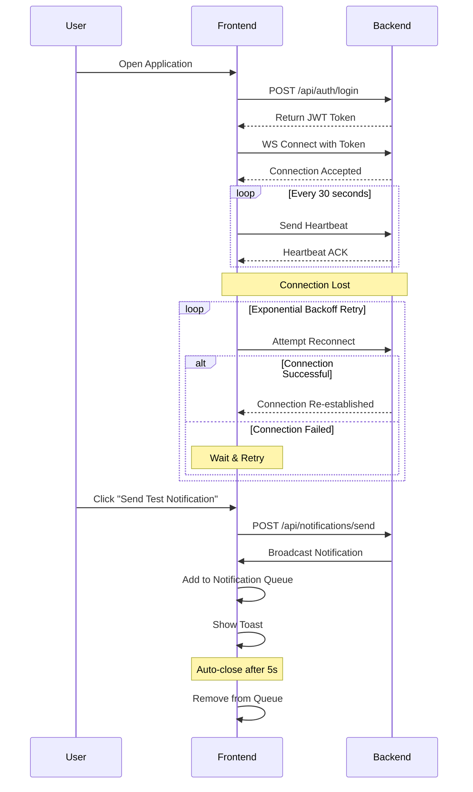

# Real-time WebSocket Notification System

A real-time notification system with React frontend and FastAPI backend, featuring WebSocket communication, JWT authentication, and priority-based notifications.

## Prerequisites

- Node.js (>=18.x)
- Python (>=3.11)
- npm or yarn
- pip

## Project Structure

```
realtime-ws-notification/
├── frontend/          # React frontend application
└── backend/           # FastAPI backend application
```

## Setup Instructions

### Frontend Setup

1. Navigate to the frontend directory:

   ```bash
   cd frontend
   ```

2. Install dependencies:

   ```bash
   npm install
   ```

3. Create environment file:
   Create a `.env` file in the frontend directory with:

   ```
   VITE_WS_URL=ws://localhost:8000/api/ws
   VITE_API_URL=http://localhost:8000
   ```

4. Start the development server:
   ```bash
   npm run dev
   ```
   The frontend will be available at http://localhost:3000

### Backend Setup

1. Navigate to the backend directory:

   ```bash
   cd backend
   ```

2. Create and activate a virtual environment:

   ```bash
   python -m venv venv
   source venv/bin/activate  # On Windows: venv\Scripts\activate
   ```

3. Install dependencies:

   ```bash
   pip install -r requirements.txt
   ```

4. Create environment file:
   Create a `.env` file in the backend directory with:

   ```
   SECRET_KEY=your-secure-secret-key
   FRONTEND_URL=http://localhost:3000
   LOG_LEVEL=DEBUG
   ```

5. Start the development server:
   ```bash
   uvicorn main:app --host 0.0.0.0 --port 8000 --reload
   ```
   The backend will be available at http://localhost:8000

## Running the Application

1. Start the backend server first:

   ```bash
   cd backend
   source venv/bin/activate  # On Windows: venv\Scripts\activate
   uvicorn main:app --host 0.0.0.0 --port 8000 --reload
   ```

2. In a new terminal, start the frontend:

   ```bash
   cd frontend
   npm run dev
   ```

3. Open your browser and navigate to http://localhost:3000

## Testing the Application

1. First, get the JWT token by logging in:

   ```bash
   curl -X POST "http://localhost:8000/api/auth/login" \
     -H "Content-Type: application/json" \
     -d '{
       "username": "admin",
       "password": "password"
     }'
   ```

   This will return a response like:

   ```json
   {
     "access_token": "your-jwt-token",
     "token_type": "bearer"
   }
   ```

2. The application will automatically attempt to authenticate and connect to the WebSocket server using the token.

3. To send a test notification, you can use the "Send Test Notification" button in the UI or use curl (replace `your-jwt-token` with the token you received from login):

   ```bash
   curl -X POST "http://localhost:8000/api/notifications/send" \
     -H "Content-Type: application/json" \
     -H "Authorization: Bearer your-jwt-token" \
     -d '{
       "title": "Test Notification",
       "message": "This is a test notification!",
       "priority": "high",
       "category": "test"
     }'
   ```

## Features

- Real-time notifications with priority levels (high, medium, low)
- JWT-based authentication
- WebSocket connection with automatic reconnection
- In-memory notification storage
- Responsive UI with toast notifications
- Auto-dismissing toast notifications

## Sequence Diagram



## Troubleshooting

If you encounter any issues:

1. Check that both frontend and backend servers are running
2. Verify that the environment variables are correctly set
3. Ensure the WebSocket connection is established (check browser console)
4. Check the backend logs for any errors

## Development

- Frontend runs on http://localhost:3000
- Backend runs on http://localhost:8000
- WebSocket endpoint: ws://localhost:8000/ws
- API documentation: http://localhost:8000/docs
